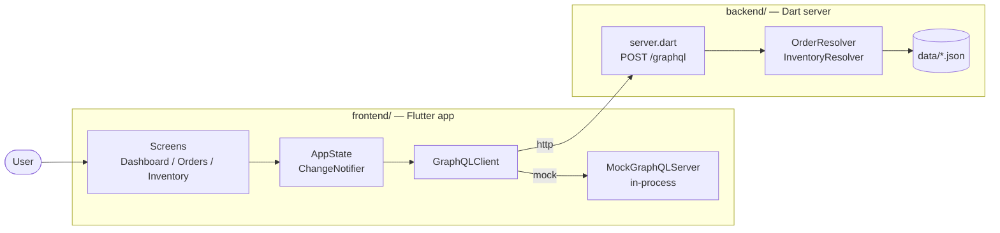
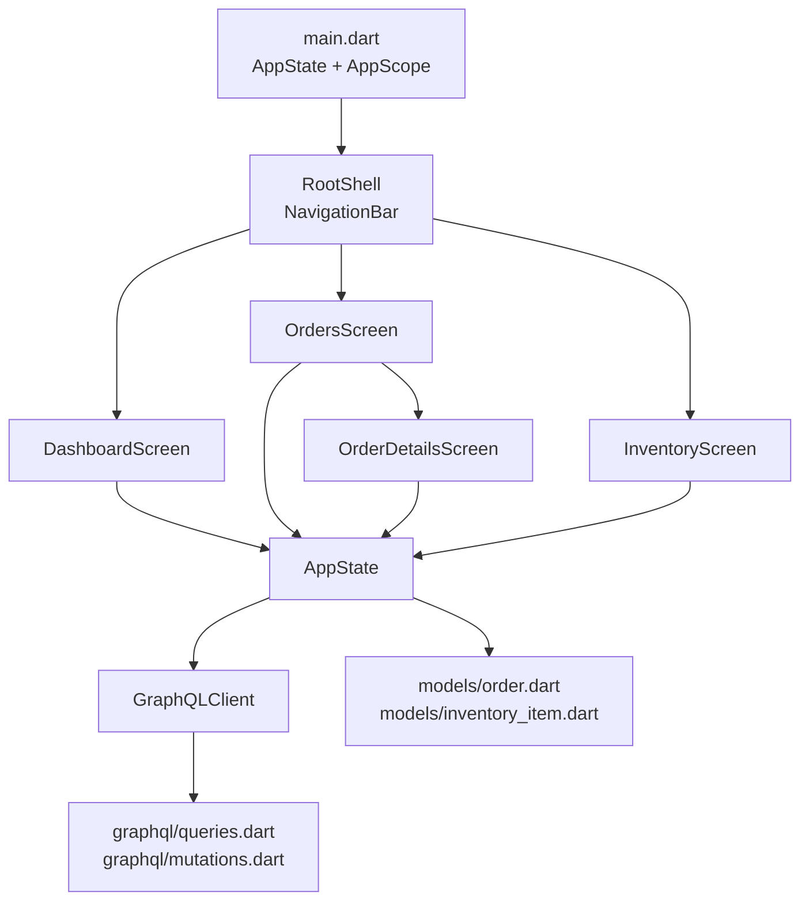
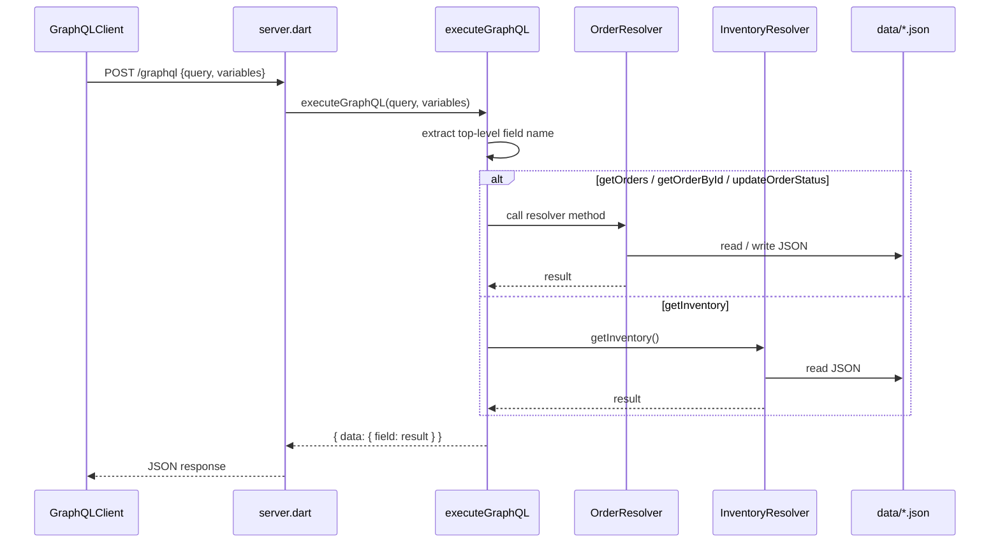

# Calebsons Flutter + GraphQL Business Operations Suite

A full-stack business operations suite built entirely with Dart and Flutter.
It ships a runnable Flutter application, a minimal GraphQL API implemented
without any third-party GraphQL libraries, and a CI/CD folder with working
automation examples.

## Project overview

| Layer     | Location    | Responsibility                                                 |
| --------- | ----------- | -------------------------------------------------------------- |
| Frontend  | `frontend/` | Flutter app — dashboard, orders, order details, inventory      |
| Backend   | `backend/`  | Dart HTTP + GraphQL server backed by JSON files                |
| CI/CD     | `cicd/`     | GitHub Actions workflows + helper shell scripts                |

Highlights:

- No external GraphQL packages. The client is a custom POST-to-`/graphql`
  implementation. The server is a hand-written top-level-field dispatcher.
- The Flutter app can run against the real backend **or** an in-process
  mock server with identical semantics, selectable by a single enum.
- State management uses `ChangeNotifier` + `InheritedNotifier` — no
  external state packages.

## Folder structure

```
calebsons_flutter_graphql_business_operations_suite/
├── frontend/
│   ├── lib/
│   │   ├── main.dart
│   │   ├── core/
│   │   │   └── graphql_client.dart
│   │   ├── models/
│   │   │   ├── order.dart
│   │   │   └── inventory_item.dart
│   │   ├── features/
│   │   │   ├── dashboard/dashboard_screen.dart
│   │   │   ├── orders/orders_screen.dart
│   │   │   ├── orders/order_details_screen.dart
│   │   │   └── inventory/inventory_screen.dart
│   │   ├── graphql/
│   │   │   ├── queries.dart
│   │   │   └── mutations.dart
│   │   └── mock_server/
│   │       └── mock_graphql_server.dart
│   ├── assets/{icons,images}/
│   ├── pubspec.yaml
│   └── walkthrough.md
├── backend/
│   ├── server.dart
│   ├── schema.graphql
│   ├── resolvers/
│   │   ├── order_resolver.dart
│   │   └── inventory_resolver.dart
│   ├── data/
│   │   ├── orders.json
│   │   └── inventory.json
│   └── README.md
├── cicd/
│   ├── github_actions/
│   │   ├── flutter_ci.yml
│   │   └── backend_ci.yml
│   └── scripts/
│       ├── format.sh
│       └── test.sh
└── README.md
```

## Setup

### Backend

```bash
cd calebsons_flutter_graphql_business_operations_suite
dart run backend/server.dart
```

This starts a GraphQL server on `http://localhost:8080/graphql`. See
`backend/README.md` for the full operation reference and `curl` examples.

### Frontend

```bash
cd calebsons_flutter_graphql_business_operations_suite/frontend
flutter create .        # first time only — generates platform folders
flutter pub get
flutter run
```

By default the app uses the in-process mock server, so the backend does
not need to be running. To switch to the real backend, set the client in
`lib/main.dart`:

```dart
final state = AppState(
  client: GraphQLClient(backend: GraphQLBackend.http),
);
```

## Architecture

### High-level system architecture



### Frontend architecture



### Backend GraphQL resolver flow



## CI/CD

Two GitHub Actions workflows live in `cicd/github_actions/`:

- **`flutter_ci.yml`** — on every push/PR touching `frontend/`:
  1. Sets up Flutter stable.
  2. Runs `flutter create .` to materialize platform folders.
  3. `flutter pub get` → `flutter analyze` → `flutter test`.
- **`backend_ci.yml`** — on every push/PR touching `backend/`:
  1. Sets up the Dart SDK.
  2. `dart format --set-exit-if-changed backend`.
  3. `dart analyze backend`.
  4. `dart test backend` when a `backend/test/` directory exists.

To wire these into GitHub, either symlink or copy the YAML files into
`.github/workflows/` at the repository root.

Local helpers in `cicd/scripts/`:

- `format.sh` — runs `dart format` across backend and frontend.
- `test.sh`   — runs analyze + test for both backend and frontend.

```bash
bash cicd/scripts/test.sh
```

## Extending the system

1. **Add a GraphQL operation**
   - Append the document to `frontend/lib/graphql/queries.dart` or
     `mutations.dart`.
   - Update `backend/schema.graphql`.
   - Handle the new field in `backend/server.dart`'s `executeGraphQL`
     switch **and** in `frontend/lib/mock_server/mock_graphql_server.dart`.
   - Add resolver logic under `backend/resolvers/`.
2. **Add a model** — new file under `frontend/lib/models/` with
   `fromJson`. Expose cached data through `AppState` if shared.
3. **Add a screen** — new file under `frontend/lib/features/<area>/`.
   Either add a `NavigationDestination` in `RootShell` or push it from an
   existing screen.
4. **Swap the mock for a real backend** — construct
   `GraphQLClient(backend: GraphQLBackend.http)` in `main.dart`. The UI,
   models, and query strings do not need to change.

## Constraints honoured

- Uses only Flutter, Dart standard libraries, and `package:http`.
- No external GraphQL packages on the client or the server.
- No backend deployment required — everything runs locally with
  `dart run backend/server.dart` and `flutter run`.
